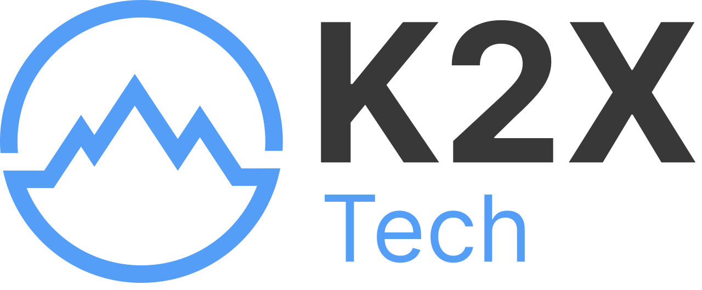
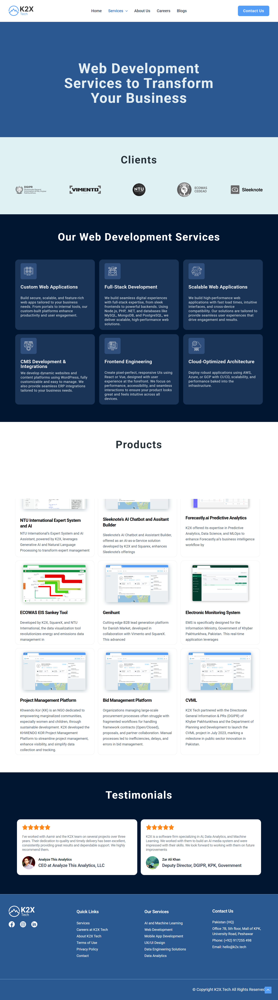

<div align="center">
  
  <h1>K2X Clone Website</h1>
  <p>A highly responsive and pixel-perfect clone of the K2X Tech enterprise website.</p>

  <!-- Badges -->
  <p>
    
    
    
    
  </p>

  <h3>
    <a href="https://sajjadkhan577.github.io/k2x-ui-clone/">🌐 View Live Demo</a>
    <span> | </span>
    <a href="#-features">✨ Features</a>
    <span> | </span>
    <a href="#-screenshots">📸 Screenshots</a>
  </h3>
</div>

<br />

## 📖 About The Project

This project is a detailed frontend clone of the K2X Technology website. It was built from the ground up to practice modern, responsive web design principles. The clone mimics the multi-page layout, dynamic carousels, mobile-friendly navigation, and detailed layout structures of the original site.

It demonstrates proficiency in clean HTML structure, custom CSS styling with Flexbox/Grid, and vanilla JavaScript for interactive components.

---

## ✨ Features

- **Fully Responsive Design**: Optimized for mobile, tablet, and desktop architectures.
- **Interactive Navigation**: Hamburger menu for mobile devices, sticky header, and dropdown submenus.
- **Multi-page Architecture**:
  - `index.html` (Home)
  - `submenu.html` (Services Detailed)
  - `blog.html` (Blog feed)
  - `contact.html` (Contact Us page)
  - `careers.html` (Join our team)
- **Dynamic UI Components**:
  - Auto-playing Hero Slider.
  - Infinite scroll effect for trusted client logos.
  - Interactive service cards with hover animations.
- **Modern Aesthetics**: Implemented smooth transitions, subtle box-shadows, and elegant typography matching the original enterprise feel.

---

## 🛠 Tech Stack

- **Markup:** HTML5 (Semantic Structure)
- **Styling:** CSS3 (Flexbox, CSS Grid, Custom Variables, Media Queries)
- **Interactivity:** Vanilla JavaScript (ES6+, DOM Manipulation)
- **Icons:** FontAwesome v6.4

---

## 📸 Screenshots

Here are a few glimpses of the cloned interface:

### Home Page Showcase


### Services & Details


*(See the `screenshot` folder for more captures of various pages!)*

---

## 🚀 Getting Started

To get a local copy up and running, follow these simple steps:

### Prerequisites
You only need a modern web browser to view the site, and a code editor (like VS Code) to edit it.

### Installation

1. **Clone the repo**
   ```sh
   git clone https://github.com/sajjadkhan577/K2x-clone.git
   ```
2. **Navigate to the project directory**
   ```sh
   cd K2x-clone
   ```
3. **Open the project**
   - Simply double-click on `index.html` to open it in your default browser.
   - Alternatively, use the **Live Server** extension in VS Code for hot-reloading.

---

## 📁 Project Structure

```text
K2x-clone/
├── images/               # Image assets and logos
├── screenshot/           # Website screenshots
├── index.html            # Main homepage
├── submenu.html          # Detailed services page
├── blog.html             # Blog articles listing
├── contact.html          # Contact form and info
├── careers.html          # Job openings and culture
├── style.css             # Unified project stylesheet
├── script.js             # Form validation, sliders, and navigation logic
├── .gitignore            # Ignored files for Git
├── LICENSE               # MIT License file
└── README.md             # Project documentation (this file)
```

---

## 🤝 Contributing

Contributions are what make the open source community such an amazing place to learn, inspire, and create. Any contributions you make are **greatly appreciated**.

1. Fork the Project
2. Create your Feature Branch (`git checkout -b feature/AmazingFeature`)
3. Commit your Changes (`git commit -m 'Add some AmazingFeature'`)
4. Push to the Branch (`git push origin feature/AmazingFeature`)
5. Open a Pull Request

---

## 📝 License

Distributed under the MIT License. See `LICENSE` for more information.

---

## 💬 Contact

**Sajjad Khan**  
GitHub: [@sajjadkhan577](https://github.com/sajjadkhan577)

Project Link: [https://github.com/sajjadkhan577/K2x-clone](https://github.com/sajjadkhan577/K2x-clone)

<br/>
<div align="center">
  <i>Made with ❤️ by Sajjad Khan</i>
</div>
